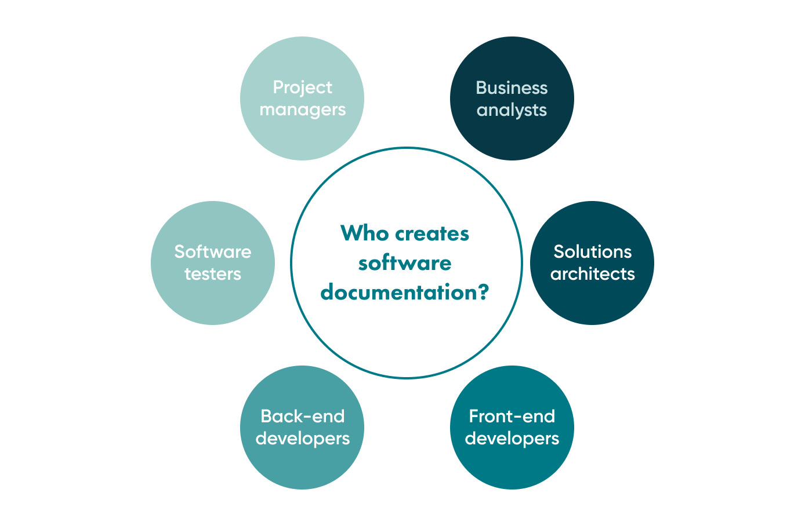
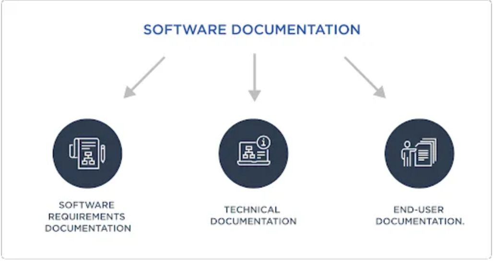
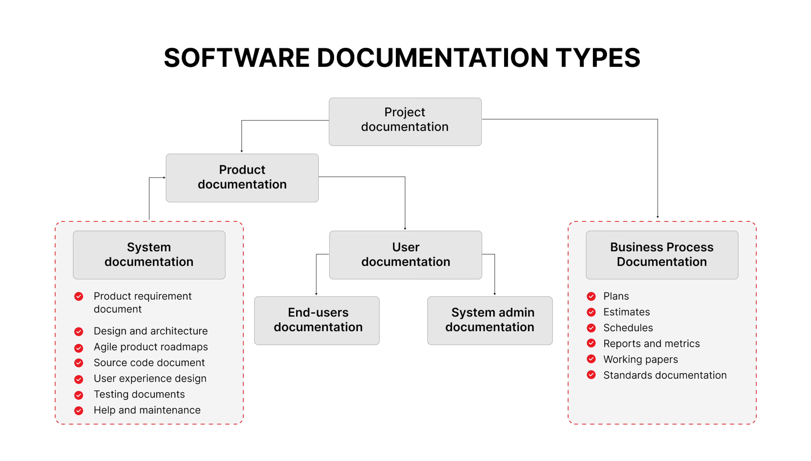

# dgl104-programming-article-repo

# The Importance of Documentation in Programming

## Introduction

Documentation is like a user manual for software. It helps developers, testers, and users understand how everything works. Without it, even the best-written code can be confusing, leading to wasted time and frustration.

In this article, I’ll talk about why documentation is important, the different types of documentation, best practices, and how to write clear, useful documentation with examples.

## Why Create Software Documentation

When developing software, a lot of information is created—about how the software works, how to use it, and how to improve it. This information is useful for developers, customers, and potential users. If you don’t record it properly, you might lose important details, misunderstand something, or forget parts of the project.

Good documentation is especially helpful for large or complex projects. It provides essential details about both the development process and the final product.

### What Happens If You Ignore Documentation?

If you don’t document your software properly, several problems can arise:

**Difficult Maintenance** – Without clear documentation, fixing bugs or updating the software becomes harder.

**Scaling Issues** – Expanding the software with new features may lead to errors if there’s no proper reference for existing functionality.

**Trouble for New Team Members** – If a new developer joins the team, they may struggle to understand the project without documentation.

**Missed Deadlines & Budget Issues** – A lack of clear documentation can slow down development, leading to delays and extra costs.

**Frustrated Clients** – Poor documentation can cause mistakes in development, leading to dissatisfied customers.

Surveys show that 34.7% of software engineers consider poor documentation one of their biggest challenges. Often, teams don’t realize the importance of documentation until problems arise. By then, it’s already causing delays and financial losses.

## Types of Documentations in Software Industry

##  Best practices for creating software documentation

Good software documentation makes it easier for developers, users, and teams to understand and use a product. Here are six simple best practices to follow:

1. Understand User Needs:

Before writing documentation, think about who will use it. Developers should know what users struggle with and create guides that solve those problems.

2. Keep It Simple and Clear

Write in a way that is easy to understand. Avoid long, complicated explanations or technical terms that users might not know. Use short sentences and clear instructions.

3. Get Help from Experts

Experienced team members and subject matter experts can make sure the documentation is accurate and useful. Their knowledge helps create better, more detailed guides.

4. Use Analytics for Improvement

Tracking how users interact with documentation can show what works and what doesn’t. If people struggle with a certain topic, you can improve that section.

5. Ask for User Feedback

After launching the software, ask users what they found helpful or confusing. Use their feedback to improve both the software and its documentation.

6. Keep It Updated

Software changes over time, so documentation should be updated too. Whenever new features are added or existing ones change, the documentation should reflect those updates.

By following these best practices, teams can create documentation that is helpful, clear, and always up to date!

## Examples of software documentation

Software documentation comes in different forms, depending on who needs it and what it explains. Here are some common types:

1. System Documentation

Includes architectural diagrams that show how the software is structured and how different parts work together.

2. API Documentation

A guide for developers on how to use an application programming interface (API).

It explains how different software components communicate with each other.

3. README Files

A short overview of the software, usually found in the source code.

It explains what the software does and how to install or use it.

4. Release Notes

A summary of changes in each version of the software.

Lists new features, bug fixes, and improvements.

5. How-To Guides

Step-by-step instructions on how to install, set up, or use the software.

Useful for both IT teams and end users.

6. Tutorials

Walk users through a series of steps to learn a feature or function of the software.

Helps new users get familiar with the system.

7. Reference Documents

Detailed technical information about the software.

Used by IT professionals for troubleshooting and advanced configurations.

8. Explanations

Clarifies specific parts of the software.

Helps users understand how and why certain features work.

Each type of documentation serves a different purpose, making software easier to use, maintain, and develop!

## Software documentation tools

Many tools help developers and vendors create and manage software documentation. Here are some important features of top documentation tools:

1. Markdown and HTML Support

Documentation is often written in Markdown (a simpler version of HTML) or HTML itself.

These formats help structure and style the content easily.

2. Feedback System

good tool allows users to give feedback on the documentation.

Some tools let users suggest edits or contribute code examples to improve the content.

Feedback can be collected through comments or emails.

3. Access Control

Teams can collaborate on documentation while controlling who can edit or view it.

Roles and permissions help manage access, ensuring that only authorized people can make changes.

4. Clickable APIs

Some tools allow users to test APIs directly from the documentation with a single click.

This helps developers understand how the API works without writing extra code.

5. Table of Contents

A table of contents makes it easy for users to navigate through long documents.

It helps people find the information they need quickly.

6. Publishing Control

Writers can publish or unpublish documentation pages as needed.

This ensures that only updated and correct information is available to users.

These features make software documentation more organized, user-friendly, and easy to maintain!

## Conclusion

Good documentation is an essential part of software development. It helps developers, testers, and users understand how the software works, making it easier to maintain, update, and scale. Without proper documentation, projects can become confusing, leading to wasted time, increased costs, and frustrated users.

By following best practices—such as understanding user needs, keeping documentation clear, gathering feedback, and regularly updating it—teams can create useful and reliable documentation. Different types of documentation, like system documentation, API guides, README files, and tutorials, serve different purposes and help various users.

Using the right tools makes documentation easier to create and maintain. Features like Markdown support, access control, feedback options, and publishing controls help keep documentation organized and user-friendly.

In the long run, well-written documentation improves teamwork, reduces errors, and ensures a smooth development process. Investing time in good documentation now can save countless hours in the future.

## References

Link 1: https://medium.com/@o.kornienko/why-software-documentation-is-important-steps-to-create-it-in-2023-820dcd2fd6fa#:~:text=Technical%20documentation%20for%20software%20serves,and%20facilitating%20smooth%20software%20implementation.

Link 2: https://www.techtarget.com/searchsoftwarequality/definition/documentation#:~:text=Software%20documentation%20provides%20information%20about,such%20as%20installation%20and%20troubleshooting.